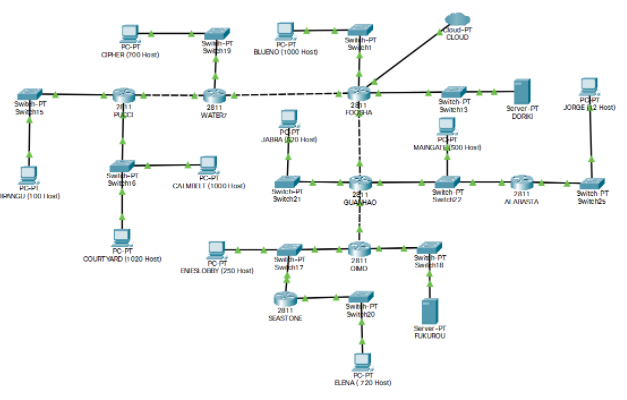
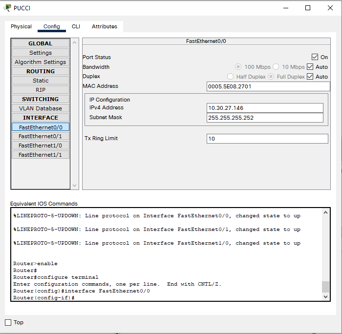
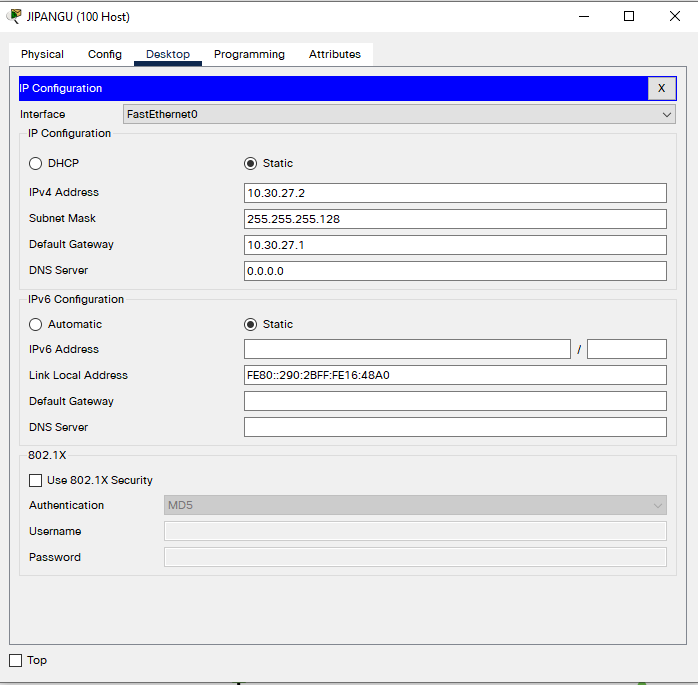
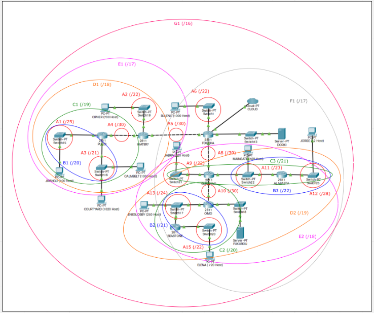

# Jarkom-Modul-4-E02-2021

Berikut adalah laporan resmi Praktikum Jaringan Komputer Modul 4 tahun 2021

Anggota Kelompok E02:

- 05111940000050 - Erki Kadhafi Rosyid
- 05111940000063 - Ryan Garnet Andrianto
- 05111940000141 - Muhammad Farhan Haykal



## Intro

Pada praktikum modul 4, software yang digunakan adalah CPT (Cisco Packet Tracker) dan GNS3. 
Metode perhitungan classless yang harus digunakan adalah VLSM dan CIDR.
Kelompok E02 menentukan metode **VLSM diterapkan di CPT**, sedangkan metode **CIDR diterapkan di GNS3**.

Pertama-tama, pemberian nama subnet dilakukan (A1, A2, A3, ..., A15). Berikut ini adalah gambar plotting subnet A1 sampai dengan A15.


Setelah pemberian nama subnet telah dilakukan, pendataan kebutuhan IP dari setiap subnet dilakukan dimulai dari subnet A1 sampai dengan A15.

1. Subnet A1 menghubungkan client JIPANGU (100 Host) dan router PUCCI. Client JIPANGU membutuhkan 100 IP dan router PUCCI membutuhkan 1 IP sehingga total kebutuhan IP-nya adalah 100+1=101.
2. Subnet A2 menghubungkan client CIPHER (700 Host) dan router WATER7. Client CIPHER membutuhkan 700 IP dan router WATER7 membutuhkan 1 IP sehingga total kebutuhan IP-nya adalah 700+1=701.
3. Subnet A3 menghubungkan client COURTYARD (1020 Host), client CALMBELT (1000 Host), dan router PUCCI. Client COURTYARD membutuhkan 1020 IP, client CALMBELT membutuhkan 1000 IP, dan router PUCCI membutuhkan 1 IP sehingga total kebutuhan IP-nya adalah 1020+1000+1=2021.
4. Subnet A4 menghubungkan router PUCCI dan router WATER7. Masing-masing membutuhkan 1 IP sehingga total kebutuhan IP-nya adalah 1+1=2.
5. Subnet A5 menghubungkan router WATER7 dan router FOOSHA. Masing-masing membutuhkan 1 IP sehingga total kebutuhan IP-nya adalah 1+1=2.
6. Subnet A6 menghubungkan client BLUENO (1000 Host) dan router FOOSHA. Client BLUENO membutuhkan 1000 IP dan router FOOSHA membutuhkan 1 IP sehingga total kebutuhan IP-nya adalah 1000+1=1001.
7. Subnet A7 menghubungkan server DORIKI dan router FOOSHA. Masing-masing membutuhkan 1 IP sehingga total kebutuhan IP-nya adalah 1+1=2.
8. Subnet A8 menghubungkan router FOOSHA dan router GUANHAO. Masing-masing membutuhkan 1 IP sehingga total kebutuhan IP-nya adalah 1+1=2.
9. Subnet A9 menghubungkan client JABRA (520 Host) dan router GUANHAO. Client JABRA membutuhkan 520 IP dan router GUANHAO membutuhkan 1 IP sehingga total kebutuhan IP-nya adalah 520+1=521.
10. Subnet A10 menghubungkan router GUANHAO dan router OIMO. Masing-masing membutuhkan 1 IP sehingga total kebutuhan IP-nya adalah 1+1=2.
11. Subnet A11 menghubungkan router GUANHAO, router ALABASTA, dan client MAINGATE (500 Host). Client MAINGATE membutuhkan 500 IP, router GUANHAO membutuhkan 1 IP, dan router ALABASTA membuthkan 1 IP sehingga total kebutuhan IP-nya adalah 500+1+1=502.
12. Subnet A12 menghubungkan router ALABASTA dan client JORGE (12 Host). Client JORGE membutuhkan 12 IP dan router ALABASTA membutuhkan 1 IP sehingga total kebutuhan IP-nya adalah 12+1=13.
13. Subnet A13 menghubungkan router OIMO, router SEASTONE, dan client ENIESLOBBY (250 Host). Client ENIESLOBBY membutuhkan 250 IP, router SEASTONE membutuhkan 1 IP, dan router OIMO membutuhkan 1 IP sehingga total kebutuhan IP-nya adalah 250+1+1=252.
14. Subnet A14 menghubungkan router OIMO dan server FUKUROU. Masing-masing membutuhkan 1 IP sehingga total kebutuhan IP-nya adalah 1+1=2.
15. Subnet A15 menghubungkan router SEASTONE dan client ELENA (720 Host). Client ELENA membutuhkan 720 IP dan router SEASTONE membutuhkan 1 IP sehingga total kebutuhan IP-nya adalah 720+1=721.

Dengan demikian total kebutuhan IP adalah 5845 dan netmask /19 cukup untuk digunakan.

Berdasarkan hasil pendataan di atas, dibuat Tabel 1. Tabel Kebutuhan IP Setiap Subnet dan Netmask Minimum

| Subnet | Jumlah IP | Netmask |
| --- | --- | --- |
| A1 | 101 | /25 |
| A2 | 701 | /22 |
| A3 | 2021 | /21 |
| A4 | 2 | /30 |
| A5 | 2 | /30 |
| A6 | 1001 | /22 |
| A7 | 2 | /30 |
| A8 | 2 | /30 |
| A9 | 521 | /22 |
| A10 | 2 | /30 |
| A11 | 502 | /23 |
| A12 | 13 | /28 |
| A13 | 252 | /24 |
| A14 | 2 | /30 |
| A15 | 721 | /22 |
| Total | 5845 | /19 |

## Cisco Packet Tracer - Metode VLSM

Metode VLSM digunakan untuk membagi alamat-alamat IP pada CPT (Cisco Packet Tracker)

### Topologi


### Tree Pembagian IP

Berdasarkan Tabel 1. Tabel Kebutuhan IP Setiap Subnet dan Netmask Minimum, pembagian IP dilakukan dengan model tree (pohon). Berikut ini adalah tree-nya.


Prefix IP yang harus digunakan adalah 10.30.x.x. Dengan demikian, pembagian IP dimulai dari 10.30.0.0/19. 
Pada dasarnya, pembagian IP dilakukan dengan prinsip separuh-separuh. 
Misalnya, IP 10.30.0.0/19 mempunyai range IP dari 10.30.0.0 sampai dengan 10.30.31.255. 
Oleh karena itu, seperti yang ditulis pada tree di atas, IP 10.30.0.0/19 dibagi menjadi dua yaitu IP 10.30.0.0 sampai dengan 10.30.15.255 yang dapat ditulis 10.30.0.0/20 dan IP 10.30.16.0 sampai dengan 10.30.31.255 yang dapat ditulis 10.30.16.0/20.

### Tabel Pembagian IP
Setelah melakukan pembagian IP menggunakan tree, daftar IP disajikan ke dalam table

| Name | Hosts Needed | Hosts Available | Unused Hosts | Network Address | Slash |       Mask      |         Usable Range        |   Broadcast  |  Wildcard |
|:----:|:------------:|:---------------:|:------------:|:---------------:|:-----:|:---------------:|:---------------------------:|:------------:|:---------:|
|  A3  |     2021     |       2046      |      25      |    10.30.0.0    |  /21  |  255.255.248.0  |   10.30.0.1 - 10.30.7.254   |  10.30.7.255 | 0.0.7.255 |
|  A6  |     1001     |       1022      |      21      |    10.30.8.0    |  /22  |  255.255.252.0  |   10.30.8.1 - 10.30.11.254  | 10.30.11.255 | 0.0.3.255 |
|  A15 |      721     |       1022      |      301     |    10.30.12.0   |  /22  |  255.255.252.0  |  10.30.12.1 - 10.30.15.254  | 10.30.15.255 | 0.0.3.255 |
|  A2  |      701     |       1022      |      321     |    10.30.16.0   |  /22  |  255.255.252.0  |  10.30.16.1 - 10.30.19.254  | 10.30.19.255 | 0.0.3.255 |
|  A9  |      521     |       1022      |      501     |    10.30.20.0   |  /22  |  255.255.252.0  |  10.30.20.1 - 10.30.23.254  | 10.30.23.255 | 0.0.3.255 |
|  A11 |      502     |       510       |       8      |    10.30.24.0   |  /23  |  255.255.254.0  |  10.30.24.1 - 10.30.25.254  | 10.30.25.255 | 0.0.1.255 |
|  A13 |      252     |       254       |       2      |    10.30.26.0   |  /24  |  255.255.255.0  |  10.30.26.1 - 10.30.26.254  | 10.30.26.255 | 0.0.0.255 |
|  A1  |      101     |       126       |      25      |    10.30.27.0   |  /25  | 255.255.255.128 |  10.30.27.1 - 10.30.27.126  | 10.30.27.127 | 0.0.0.127 |
|  A12 |      13      |        14       |       1      |   10.30.27.128  |  /28  | 255.255.255.240 | 10.30.27.129 - 10.30.27.142 | 10.30.27.143 |  0.0.0.15 |
|  A4  |       2      |        2        |       0      |   10.30.27.144  |  /30  | 255.255.255.252 | 10.30.27.145 - 10.30.27.146 | 10.30.27.147 |  0.0.0.3  |
|  A5  |       2      |        2        |       0      |   10.30.27.148  |  /30  | 255.255.255.252 | 10.30.27.149 - 10.30.27.150 | 10.30.27.151 |  0.0.0.3  |
|  A7  |       2      |        2        |       0      |   10.30.27.152  |  /30  | 255.255.255.252 | 10.30.27.153 - 10.30.27.154 | 10.30.27.155 |  0.0.0.3  |
|  A8  |       2      |        2        |       0      |   10.30.27.156  |  /30  | 255.255.255.252 | 10.30.27.157 - 10.30.27.158 | 10.30.27.159 |  0.0.0.3  |
|  A10 |       2      |        2        |       0      |   10.30.27.160  |  /30  | 255.255.255.252 | 10.30.27.161 - 10.30.27.162 | 10.30.27.163 |  0.0.0.3  |
|  A14 |       2      |        2        |       0      |   10.30.27.164  |  /30  | 255.255.255.252 | 10.30.27.165 - 10.30.27.166 | 10.30.27.167 |  0.0.0.3  |

Daftar IP dari tabel tersebut akan digunakan pada konfigurasi pada Cisco Packet Tracer, salah satu contoh nya adalah pada konfigurasi subnet A1 yang terletak pada daerah Client Jipangu. Pertama adah contoh konfigurasi Router Pucci yang mengarah gateway ke subnet A1. 



Pada gambar di atas, ipv4 address dari pucci diarahkan ke ip yang terdaftar di tabel subnet A1 ditambah 1. Sedangkan untuk Client Jipangu dapat dilihat seperti di bawah ini.



Pada gambar di atas, Client Jipangu akan memiliki IP yang berada dalam interval usable IP yang terdapat pada table subnet A1. Pada kasus di atas, IP Jipangu akan memiliki ip yang tertera di table **ditambah 2**. Untuk host dan router lainnya akan memiliki konfigurasi serupa seperti yang telah tertera di atas

### Tabel Routing Table
Untuk mengirim paket yang melalui lebih dari satu router maka akan memerlukan routing agar paket dapat sampai di tujuan. Untuk routing table dari VLSM dapat di lihat pada gambar di bawah ini

1. Pada router FOOSHA
```
10.30.0.0/21 via 10.30.27.150
10.30.27.0/25 via 10.30.27.150
10.30.16.0/22 via 10.30.27.150
10.30.20.0/22 via 10.30.27.158
10.30.24.0/23 via 10.30.27.158
10.30.27.128/28 via 10.30.27.158
10.30.26.0/24 via 10.30.27.158
10.30.12.0/22 via 10.30.27.158
10.30.27.144/30 via 10.30.27.150
10.30.27.164/30 via 10.30.27.158
```

2. Pada router WATER7
```
0.0.0.0/0 via 10.30.27.149
10.30.27.0/25 via 10.30.27.146
10.30.0.0/21 via 10.30.27.146
```

3. Pada router PUCCI
```
0.0.0.0/0 via 10.30.27.145
```

4. Pada router GUANHAO
```
10.30.27.128/28 via 10.30.24.3
10.30.26.0/24 via 10.30.27.162
0.0.0.0/0 via 10.30.27.157
10.30.12.0/22 via 10.30.27.162
10.30.27.164/30 via 10.30.27.162
```

5. Pada router ALABASTA
```
0.0.0.0/0 via 10.30.24.1
```

6. Pada router OIMO
```
10.30.12.0/22 via 10.30.26.3
0.0.0.0/0 via 10.30.27.161
```

7. Pada router SEASTONE
```
0.0.0.0/0 via 10.30.26.1
```

Setelah konfigurasi di atas di tambahkan di setiap router, maka 

## GNS3 - Metode CIDR
### Gambar Topologi
Pada metode CIDR, kami melakukan perhitungan sebagai berikut



Pada topologi di atas, kami tidak memperhitungkan server untuk dibuat subnet tersendiri sehingga pada hasil akhir kami mendapat IP dengan subnet terbesar yaitu `/16`

### Tree pembagian

### Tabel Pembagian IP
### Tabel Routing Table

